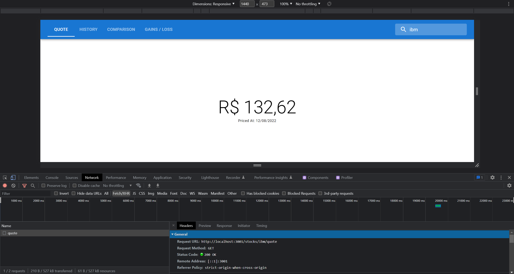
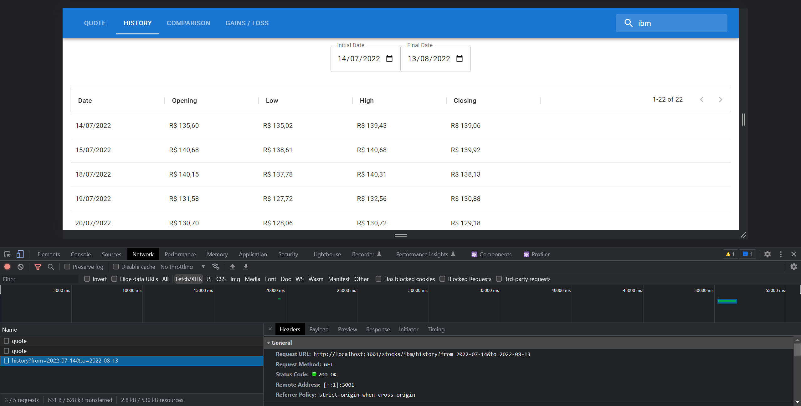
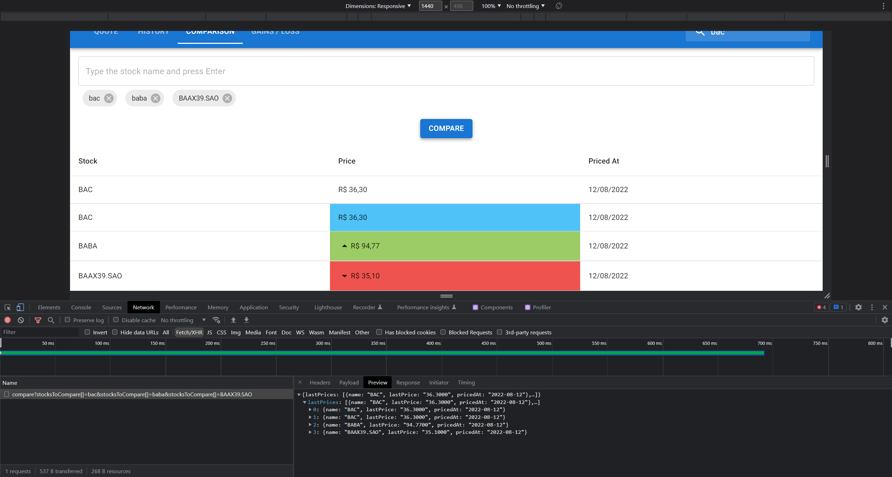
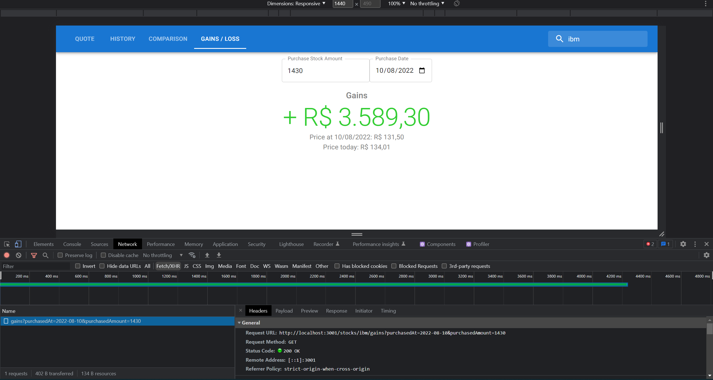

<!-- GETTING STARTED -->

## Getting Started

### Pré-requisitos

- npm
  ```sh
  npm install npm@latest -g
  ```

### Instalação

1. Clone o repositorio
   ```sh
   git clone https://github.com/arthurfcs98/hiring-node.git
   ```
2. Entre na pasta server
   ```sh
   cd ./server/
   ```
3. Instale as dependencias
   ```sh
   npm install
   ```
4. Inicie a aplicação
   ```sh
    npm run dev
   ```
5. Em outro terminal entre no diretorio do repositorio e depois entre na pasta client
   ```sh
   cd ./client/
   ```
6. Instale as dependencias
   ```sh
   npm install
   ```
7. Inicie a aplicação
   ```sh
    npm run start
   ```
   Desse modo a aplicação estara rodando, tanto o backend como o frontend

<p align="right">(<a href="#readme-top">back to top</a>)</p>

## In Usage

Page 1 <br>
<br>
Page 2 <br>
<br>
Page 3 <br>
<br>
Page 4 <br>
<br>

<p align="right">(<a href="#readme-top">back to top</a>)</p>

##Tests

1. Entre na pasta server
   ```sh
   cd ./server/
   ```
2. Execute o arquivo teste em específico
   ```sh
   npm run test example.spec.ts
   ```
   PS:
   A API de consulta utilizada possui uma limitação de requisições por minuto, desse modo os testes necessitam ser rodados separadamente e com periodo de 1 minuto pelo menos.

## Contact

Your Name - cesarinoarthur@gmail.com

Project Link: [https://github.com/arthurfcs98/hiring-node](https://github.com/hiring/hiring-node)

<p align="right">(<a href="#readme-top">back to top</a>)</p>
